- I’m 

  

- I’m interested in aerospace, wireless communications, linux distros and cybersecurity 
- I love learning new tools
- I’m currently studying electronics and communication engineering
- How to reach me --> Send me a message on this email  (islam.my01@gmail.com)
- you can also Send me a message on my whatsapp number (    01551140777     )

and

## Tools (not a professional in some of them, but I'm learning)

### Coding

### IDEs, Engines and Virtual machines

 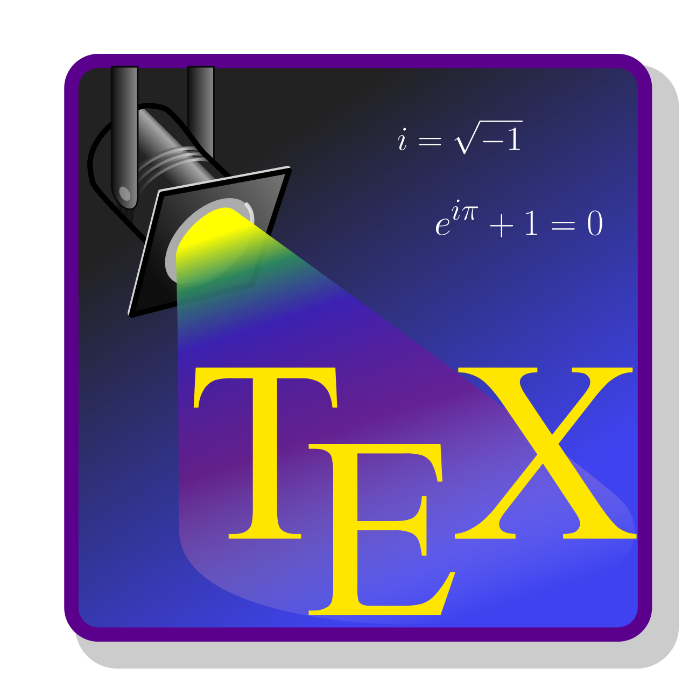
 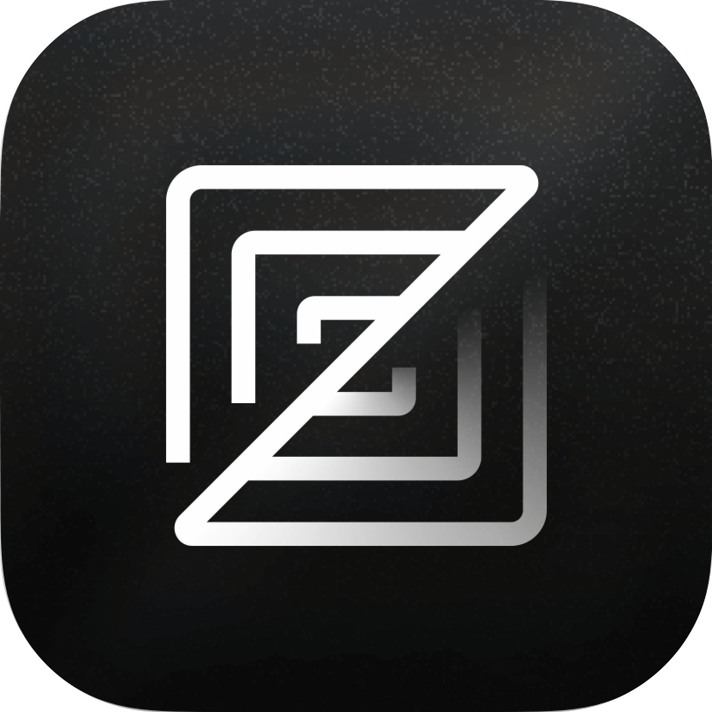
 
 
 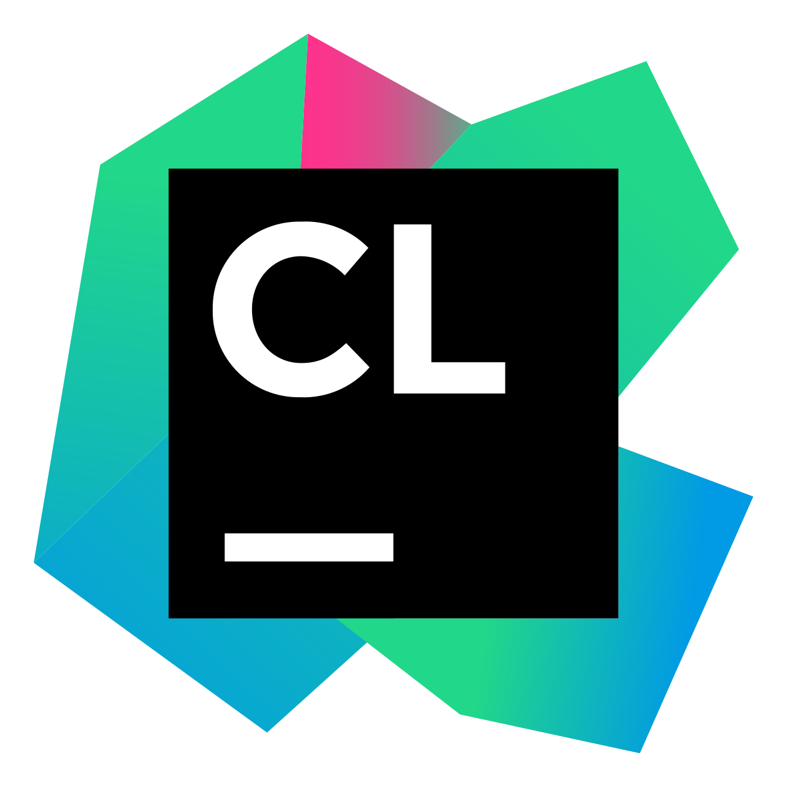
 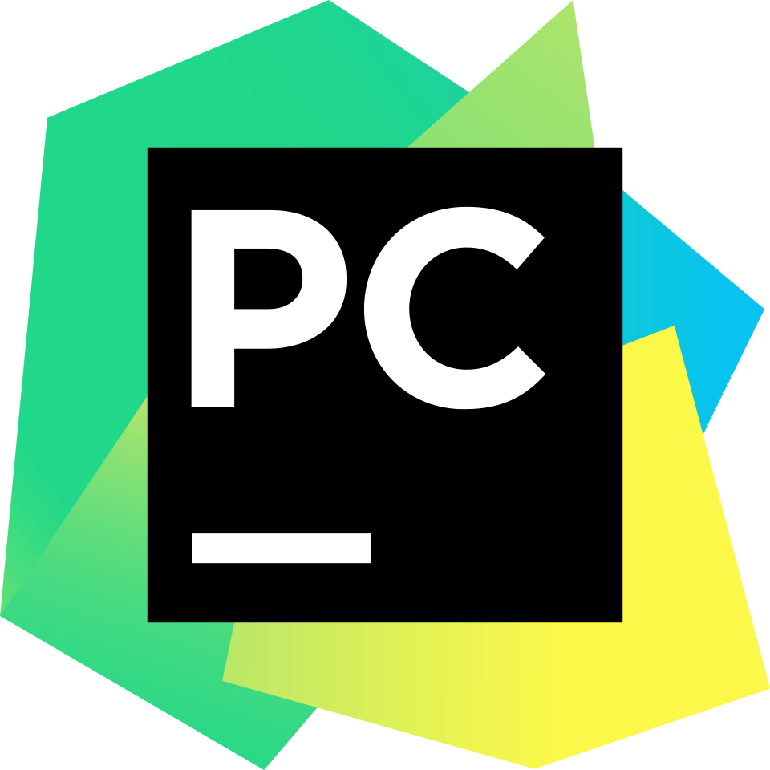
 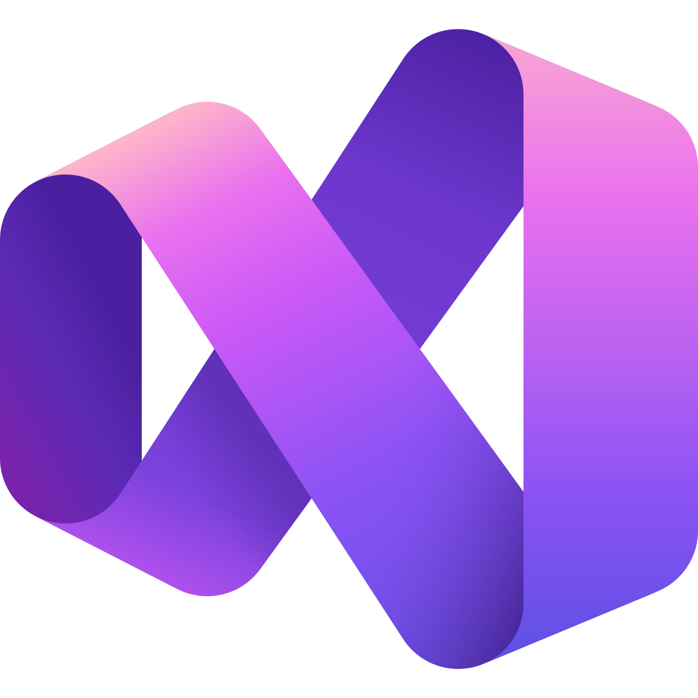
 
 
 
 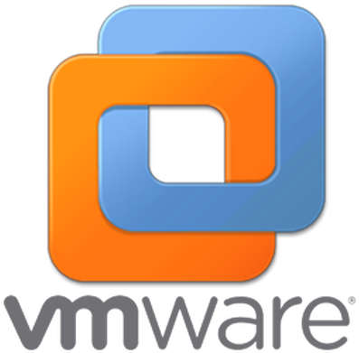

### Electronics and systems

  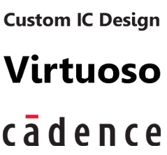
  
  
  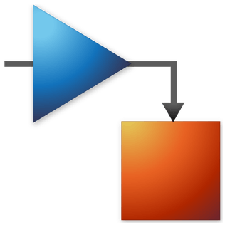
  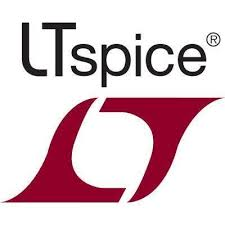
  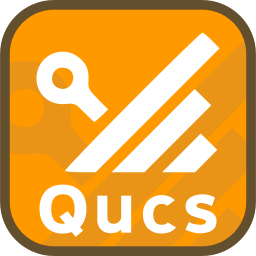
  
  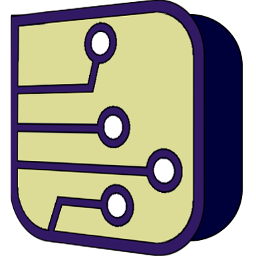
  

### Operating systems

### Project management

